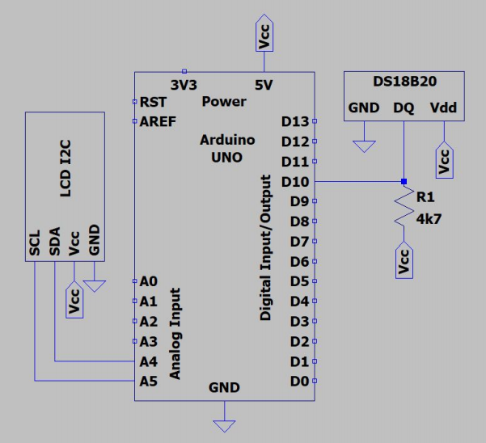

# Arduino_Temperature_Reader

Temperature reader using DS18B20 sensor with arduino uno board and 16x2 LCD. 

# Schematic  
  
# list of components
- Arduino uno board
- DS18B20 sensor
- 16x2 LCD
- 4k7 resistor